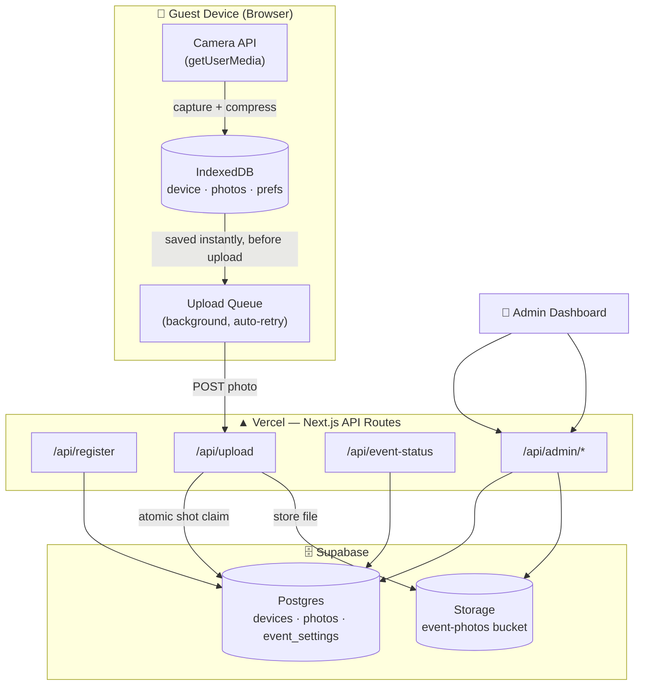
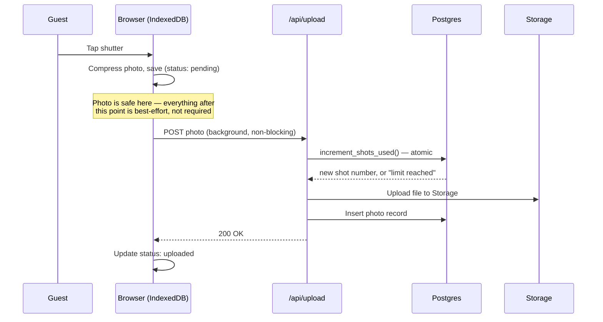

# Disposable Event Camera

A mobile-first, single-page web app that simulates a disposable film camera for a one-day event. Guests scan a QR code, enter their name once, and get a fixed number of shots — no accounts, no app installs, no fuss. Every photo is saved to the guest's device the instant it's captured and uploaded automatically in the background, so nothing is ever lost to a bad WiFi connection.

🔗 **Live App:** disposable-event-camera.vercel.app

---

## 🎂 Why I Built This

This started as a gift, not a portfolio piece. I wanted a simple way for family and friends at my son's birthday party to capture candid moments throughout the day — the way disposable film cameras used to get passed around at weddings — without asking anyone to download an app, create an account, or even know what "the app" was called. Scan a code, type your name, start shooting.

It also turned into a genuine excuse to build something with real reliability constraints, not just another CRUD tutorial: offline-first local storage, a server that's the actual source of truth for shot limits (not just the UI pretending to enforce them), and a background upload system that has to survive bad venue WiFi and guests locking their phones mid-upload.

It ran at the actual event — shots were taken, uploaded, and are safely sitting in the gallery to look back on. This README documents the finished, event-tested version.

<!-- Feel free to personalize this section further with a specific detail
     from the day — his age, a favorite photo that came out of it, how
     many guests used it, etc. -->


Built to feel like handing someone a real disposable camera at a wedding, party, or gathering — point, shoot, done. No login screens, no app store detours, just a QR code and a camera.

- **Zero-friction guest experience** — one QR code, one name entry, straight into the camera. No accounts, no passwords, no app installs.
- **Reliability-first architecture** — every photo is compressed and saved locally (IndexedDB) *before* anything else happens. A bad connection, a locked phone, or a closed tab can never lose a captured photo.
- **Server-authoritative shot limits** — the 5-shots-per-device rule (configurable) is enforced by the database itself via an atomic Postgres function, not just trusted client-side logic.
- **Automatic background uploads** — photos upload themselves in the background (one quick retry before marking a failure), and automatically resume the moment the device reconnects or the app returns to the foreground — no "upload" button, no need to babysit a spinner.
- **Full admin control** — a password-protected dashboard to open/close the event window, adjust the shot limit, monitor upload health, and reset individual devices or the whole event.
- **Gallery access doesn't end with the event** — guests can still open their gallery and download their shots after the event window closes.

## 📸 Screenshots

<!--
  Suggested screenshots — save each under /docs/screenshots/ using the
  filenames below, and the images will appear automatically once added
  (GitHub just shows a broken-image icon until the files exist).

  1. camera-screen.png    — the main capture screen mid-session: visible
     "X shots left" counter, the shutter button, and the flip-camera icon.
  2. gallery.png           — the bottom-sheet gallery open over the camera,
     showing a few thumbnails with their colored status dots.
  3. photo-preview.png     — the fullscreen photo preview, with the
     Download / Retry / Delete buttons visible at the bottom.
  4. admin-dashboard.png   — the admin dashboard showing Event Controls
     and Upload Statistics together.
  5. qr-code.png           — the actual QR code guests scanned (the
     printed sign or table card from the event, if you kept it).
  6. in-action.jpg         — optional but a nice touch for a personal
     project like this: a real photo from the event itself — the
     printed QR code on a table, or a guest holding up their phone
     using the camera.
-->

<table>
  <tr>
    <td align="center"><br><sub>Camera</sub></td>
    <td align="center"><br><sub>Gallery</sub></td>
    <td align="center"><br><sub>Admin Dashboard</sub></td>
  </tr>
</table>

## 🛠️ Tech Stack

- **Next.js** (App Router) + **TypeScript**
- **TailwindCSS**
- **Supabase** — Postgres database, Storage (photos), Row Level Security
- **IndexedDB** (via the `idb` library) — local photo persistence and device identity
- **Browser Camera API** (`getUserMedia`) — no native camera app, no third-party SDK
- **Vercel** — hosting and deployment

## 🏗️ Architecture

The whole design follows one rule, stated in the original project spec: **the server is always the source of truth for remaining shots, and a photo is never lost, regardless of what the network is doing.** Everything below exists in service of that.

### System Overview



**Why the browser never talks to Supabase directly:** Row Level Security is enabled on every table with *zero* policies — the public key exposed to guests' browsers can't read or write anything at all. Every operation goes through a Next.js API route running with the server-only secret key. This isn't just a security preference; it's what makes the shot limit trustworthy — client-side JavaScript can be edited by anyone in DevTools, but a device can't talk its way past a database function it never has direct access to.

### Capture → Upload Flow

The sequence for a single photo, from tap to confirmed upload:



If any step from the `POST` onward fails — bad WiFi, a closed tab, a locked phone — the photo simply stays `pending` or `failed` in IndexedDB. The upload queue automatically retries on reconnect or when the app returns to the foreground, and nothing above the "photo is safe here" line ever needs to be redone.

## 📁 Project Structure

```
src/
├── app/
│   ├── page.tsx                  # Guest entry point: registration → event status → camera
│   ├── admin/
│   │   ├── page.tsx               # Admin login
│   │   └── error.tsx              # Admin-specific error boundary
│   ├── error.tsx                  # Guest-facing global error boundary
│   └── api/
│       ├── register/route.ts       # Device registration (upsert)
│       ├── upload/route.ts         # Photo upload: claims shot number, uploads, records
│       ├── event-status/route.ts    # Event open/closed status for the client
│       ├── health/route.ts          # Database / Storage / config health check
│       └── admin/
│           ├── login/route.ts
│           ├── session/route.ts
│           ├── settings/route.ts     # GET/PATCH event_settings
│           ├── stats/route.ts
│           ├── reset-device/route.ts
│           └── reset-event/route.ts
├── components/
│   ├── camera/CameraScreen.tsx     # Main single-screen camera UI
│   ├── gallery/                    # Bottom-sheet gallery + fullscreen preview
│   ├── registration/RegistrationScreen.tsx
│   ├── event/EventClosedScreen.tsx
│   ├── admin/AdminDashboard.tsx
│   └── shared/                     # ConfirmDialog, Spinner
├── lib/
│   ├── supabase/{client,server}.ts  # Separate browser/server Supabase clients
│   ├── indexeddb.ts                 # IndexedDB persistence layer (device identity, prefs, photos)
│   ├── photoStore.ts                 # In-memory photo store, loaded from IndexedDB once and
│   │                                  # updated in place on every mutation - the single source of
│   │                                  # truth the gallery/camera UI reads from (see note below)
│   ├── objectUrlCache.ts             # One object URL per photo, cached by localId
│   ├── useCamera.ts                 # getUserMedia lifecycle + frame capture
│   ├── compressImage.ts             # Resize + JPEG compression before save/upload
│   ├── uploadQueue.ts                # Background upload: one retry, then fail; auto re-run on
│   │                                  # reconnect/foreground; concurrent per-device uploads
│   ├── eventStatus.ts                # Single source of truth for open/closed + shot limit
│   ├── adminAuth.ts / requireAdmin.ts
│   └── useOnlineStatus.ts
└── types/index.ts                   # Shared types mirroring the database schema
```

## 🚀 Getting Started

### Prerequisites

- Node.js v18 or higher
- A free [Supabase](https://supabase.com) account and project
- A free [Vercel](https://vercel.com) account (for deployment)

### Local Installation

```bash
git clone https://github.com/jcmcardama/disposable-event-camera.git
cd disposable-event-camera
npm install
```

### Supabase Setup

1. Create a new Supabase project.
2. In the **SQL Editor**, run the schema (tables + RLS + the atomic shot-increment function) — see [`/public/schema.sql`](./public/schema.sql) for the full script.
3. Create a **private** Storage bucket named `event-photos`.
4. Under **Settings → Data API**, grab your Project URL. Under **Settings → API Keys**, grab your **Publishable** and **Secret** keys.

### Environment Variables

Create `.env.local` in the project root:

```bash
NEXT_PUBLIC_SUPABASE_URL=your-project-url-here
NEXT_PUBLIC_SUPABASE_ANON_KEY=your-publishable-key-here
SUPABASE_SERVICE_ROLE_KEY=your-secret-key-here
ADMIN_PASSWORD=choose-a-strong-password-here
```

### Run locally

```bash
npm run dev
```

The app is available at `http://localhost:3000`, and the admin dashboard at `http://localhost:3000/admin`.

> **Note:** `getUserMedia` (the camera API) requires a secure context. `localhost` is exempt, but testing on a real phone requires either a deployed HTTPS URL or a local HTTPS tunnel.

## 📸 How to Use

### As a guest

1. Scan the event QR code (which just points to the deployed URL).
2. Enter your name — this happens once per device.
3. If the event hasn't started yet, you'll see a waiting screen that automatically opens the moment the window begins — no need to reload.
4. Tap the shutter to capture. Switch between front/rear camera with the flip button.
5. Open the gallery (bottom-left) to review, download, delete, or manually retry a failed upload for any of your shots. Swipe or use the arrow buttons to move between photos.
6. Once your shots are used, you'll see a "shots used" message — deleting a photo does **not** give you another shot back.
7. After the event window closes, your gallery is still available — you'll see a "View my photos" button on the closed-event screen to review and download your shots.

### As the host/admin

1. Go to `/admin` and log in with your `ADMIN_PASSWORD`.
2. **Event Controls** — toggle the event on/off, set the start/end window, and adjust the shot limit.
3. **Upload Statistics** — live counts of devices, total photos, and upload status breakdown.
4. **Health Check** — confirms database, storage, and configuration are all reachable.
5. **Reset** — clear a single misbehaving device (by UUID, visible in Supabase's Table Editor) or wipe the entire event's devices and photos before/after a run-through.

## 📷 Photo Quality & Resolution

Two settings control how sharp captured photos are and how much storage they use:

- **Camera stream resolution** — `src/lib/useCamera.ts`, the `getUserMedia` constraints (`width`/`height` under `ideal`). Without this, browsers can default to a low-resolution video stream regardless of what the device's camera is actually capable of — this is the setting that determines how much real detail is captured in the first place.
- **Compression** — `src/lib/compressImage.ts`, `MAX_DIMENSION` (longest side, in pixels) and `JPEG_QUALITY` (0–1). This runs *after* capture, so it can only work with whatever detail the camera stream above actually provided — raising this alone won't fix blurriness caused by a low-res stream.

Rough storage math, for sizing your own event:

```
total storage ≈ numDevices × shotsPerDevice × avgFileSizeMB
max devices before hitting Supabase's 1 GB free-tier storage cap:
  1024 ÷ (shotsPerDevice × avgFileSizeMB)
```

At `MAX_DIMENSION = 2560` / `JPEG_QUALITY = 0.92`, expect roughly 0.8–1.5 MB per photo — for 50 devices × 5 shots (250 photos), that lands around 200–375 MB total, comfortably inside the free tier with room to spare.

## 🔄 Upload Reliability Model

Every photo is compressed and saved to the device's IndexedDB **before** any upload is attempted — this is the core reliability guarantee: a lost connection, a locked phone, or a closed tab can never lose a photo that's already been captured, regardless of what happens to the upload itself.

Uploads then behave like this:

- All of a device's pending photos upload **concurrently**, not one at a time — one slow or failing photo no longer blocks the rest of that device's queue.
- Each photo gets one attempt and one quick retry; if both fail, it's marked `failed` rather than retrying indefinitely in the background.
- `failed` isn't a dead end: the upload queue automatically re-runs whenever the device reconnects (`online` event) or the app returns to the foreground (`visibilitychange`) — so most failures resolve themselves without the guest doing anything.
- A manual **"Retry upload"** button is also available in the gallery preview for any `failed` photo, for full control regardless of the automatic triggers.

## 🗄️ Free-Tier Housekeeping

Both platforms this runs on have free-tier quirks worth knowing before an event day:

- **Supabase pauses inactive free projects** after about a week of no API activity. It's fully reversible (one click to restore, data intact) as long as you notice within 90 days — but make sure to open the app or admin dashboard sometime in the week leading up to your event so it isn't paused on the day itself.
- **Vercel's Hobby plan and Supabase's free tier** are both intended for personal, non-commercial use — see [Deploying Your Own Copy](#-deploying-your-own-copy) below.


## 🌍 Deploying Your Own Copy

This project is built to be forked and reused for your own event:

1. Fork/clone the repo and follow the Supabase setup above with your **own** Supabase project.
2. Deploy to Vercel — import the repo, add the four environment variables from `.env.local` under **Project Settings → Environment Variables**, and deploy.
3. Generate a QR code pointing at your deployed `*.vercel.app` URL (or a custom domain) and print it for your event.
4. Log into `/admin` and configure your event's start/end time and shot limit before doors open.

## ⚠️ Limitations

- **Single event at a time** — `event_settings` is a singleton table by design; this isn't built for running multiple concurrent events on one deployment.
- **No guest accounts, by design** — a device is identified only by a UUID stored in its browser's IndexedDB. Clearing site data / using a private/incognito window resets that identity, which means someone can technically get more than their allotted shots by doing so repeatedly. Acceptable for a casual personal event; not intended as an abuse-proof system. Note: if a device's server record is ever removed (an admin's "Reset device," or manual database cleanup), the app will automatically re-register that same device on its next upload attempt — this is a deliberate low-friction choice for a personal event, but it means a "Reset device" isn't a hard, permanent block on that device continuing to use its cached name.
- **Private Browsing mode is not supported** — the app's reliability model depends on persistent local storage (IndexedDB), which browsers — Safari in particular — severely restrict or disable in private/incognito windows. Guests should use normal browsing mode.
- **iOS Safari cannot disable page-level pinch-to-zoom** — a deliberate accessibility decision by Apple (since iOS 10), not a limitation of this app; it applies to any website. The camera preview area itself blocks pinch gestures locally (`touch-action: none`) to avoid confusing guests, but the page as a whole can still be zoomed on iOS.
- **Admin date/time inputs render inconsistently on iOS Safari** — a known, long-standing Safari rendering quirk with `datetime-local` inputs. Functionally the settings still save correctly; it's a cosmetic issue on the admin dashboard only, and the admin dashboard is not guest-facing.
- **Storage cleanup is manual** — resetting a device or the whole event clears database records but intentionally does **not** delete the corresponding files from Supabase Storage, to avoid an irreversible action being bundled into a routine reset. Clear the Storage bucket manually via the Supabase dashboard if needed.

## 📝 Available Scripts

- `npm run dev` — start the development server
- `npm run build` — production build
- `npm start` — run the production build
- `npm run lint` — run ESLint

---

Made with ❤️ by Jan Carlo M. Cardama